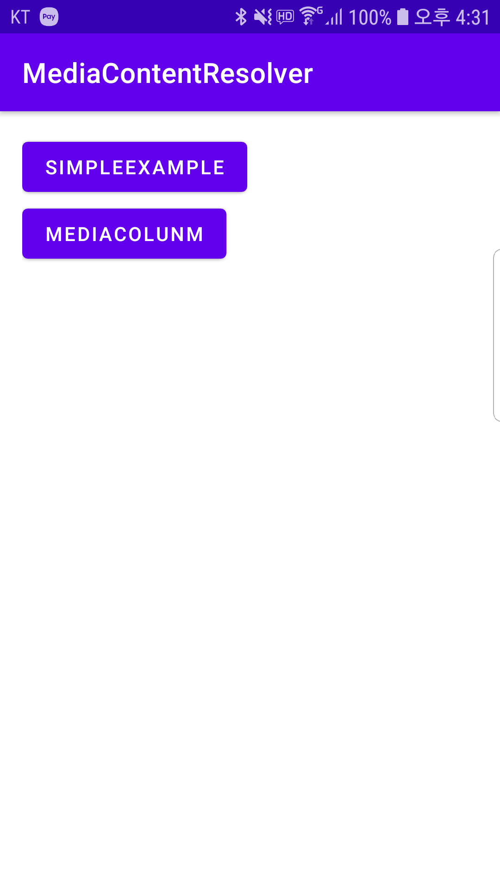

# 안드로이드 미디어 문서
https://developer.android.com/training/data-storage/shared/media

더 풍부한 사용자 경험을 제공하기위해, 많은 앱들은 외장메모리에 있는 미디어에 접근 가능하게 만들고 있습니다. 안드로이드 프레임워크는 media store라는 최적화된 인덱스를 제공합니다. 사용자에게 보다 쉽게 미디어를 수정하고 업데이트 할 수 있게 만들 수 있습니다. 

```
Note: 자신의 앱에서만 값을 제공하는 미디어파일을 작업하고자 한다면 아래 링크를 참조하기바랍니다.
https://developer.android.com/training/data-storage/app-specific#media
```

## Photo picker
미디어 스토어를 대신 안드로이드에 탑제되어있는 Android photo picker을 사용 할 수 있습니다. 권한없이 사용자가 안전하게 사진을 선택 할 수 있습니다. 지원되는 기기들이 한정되어있으니 참고바랍니다.

https://developer.android.com/training/data-storage/shared/photopicker

## Media Store
To interact with the media store abstraction, use a ContentResolver object that you retrieve from your app's context:
```
val projection = arrayOf(media-database-columns-to-retrieve)
val selection = sql-where-clause-with-placeholder-variables
val selectionArgs = values-of-placeholder-variables
val sortOrder = sql-order-by-clause

applicationContext.contentResolver.query(
    MediaStore.media-type.Media.EXTERNAL_CONTENT_URI,
    projection,
    selection,
    selectionArgs,
    sortOrder
)?.use { cursor ->
    while (cursor.moveToNext()) {
        // Use an ID column from the projection to get
        // a URI representing the media item itself.
    }
}
```
The system automatically scans an external storage volume and adds media files to the following well-defined collections:

Images, including photographs and screenshots, which are stored in the DCIM/ and Pictures/ directories. The system adds these files to the MediaStore.Images table.
Videos, which are stored in the DCIM/, Movies/, and Pictures/ directories. The system adds these files to the MediaStore.Video table.
Audio files, which are stored in the Alarms/, Audiobooks/, Music/, Notifications/, Podcasts/, and Ringtones/ directories. Additionally, the system recognizes audio playlists that are in the Music/ or Movies/ directories as well as voice recordings that are in the Recordings/ directory. The system adds these files to the MediaStore.Audio table. The Recordings/ directory isn't available on Android 11 (API level 30) and lower.
Downloaded files, which are stored in the Download/ directory. On devices that run Android 10 (API level 29) and higher, these files are stored in the MediaStore.Downloads table. This table isn't available on Android 9 (API level 28) and lower.
The media store also includes a collection called MediaStore.Files. Its contents depend on whether your app uses scoped storage, available on apps that target Android 10 or higher.

If scoped storage is enabled, the collection shows only the photos, videos, and audio files that your app has created. Most developers don't need to use MediaStore.Files to view media files from other apps, but if you have a specific requirement to do so, you can declare the READ_EXTERNAL_STORAGE permission. We recommend, however, that you use the MediaStore APIs to open files that your app hasn't created.
If scoped storage is unavailable or not being used, the collection shows all types of media files.

## 안드로이드 프레임워크 미디어
https://developer.android.com/reference/android/provider/MediaStore





```
interface MediaContentResolver {

    fun requestPermission(activity: Activity)

    fun getFolderList(): ArrayList<String>

    fun getFolderListImageData(): ArrayList<ImageData>

    fun getFolderListWithCount(): Map<String, Int>

    fun getPictureList(): ArrayList<String>

    fun getPictureList(folderPath: String): ArrayList<String>

    fun getPictureListImageData(folderPath: String): ArrayList<ImageData>

    fun getPictureListCursor(folderPath: String): Cursor?

    fun getFolderListCursor(): Cursor?

    fun printAvailableMediaColunm()
    fun printAvailableMediaColunmWithContents()

    companion object {
        fun newInstance(context: Context): MediaContentResolver {
            return MediaContentResolverImpl(context)
        }
    }
}
```

